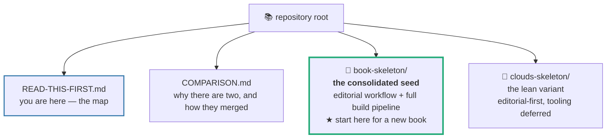
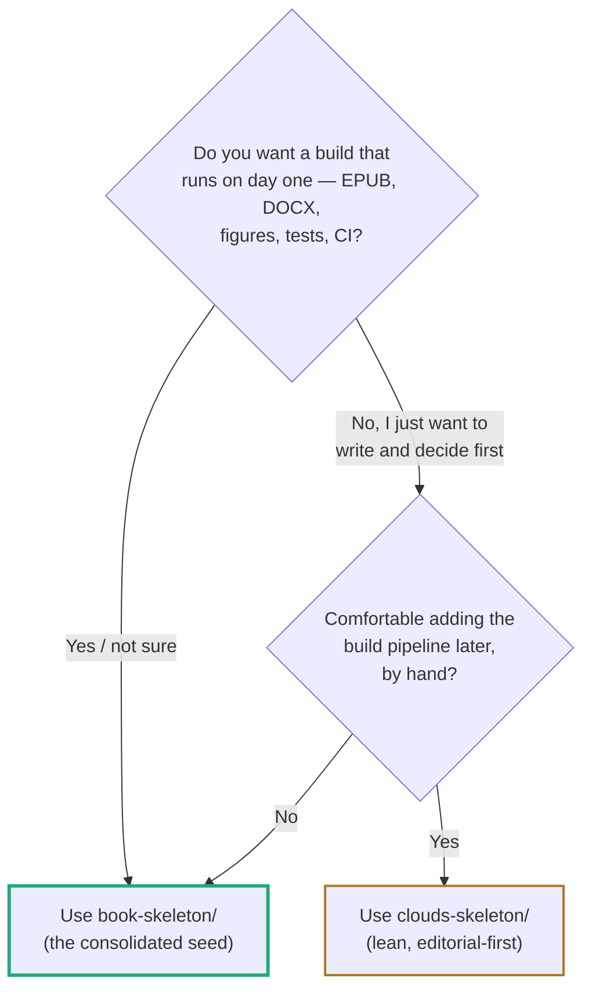
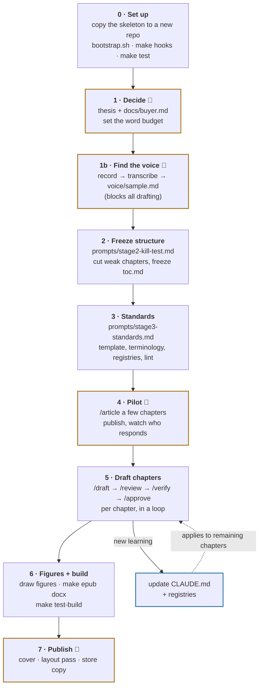
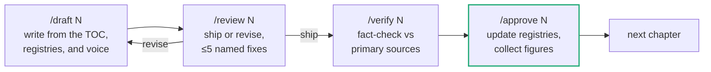
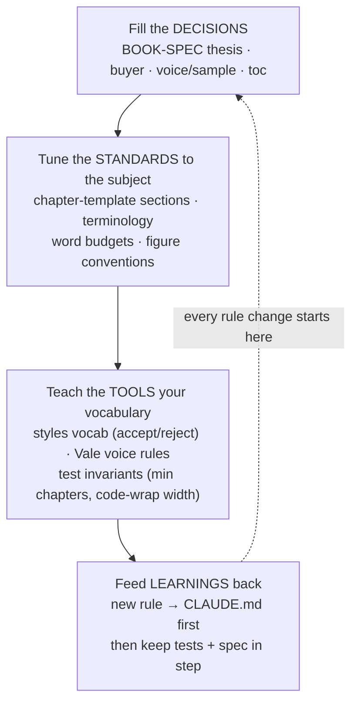

# Read This First

This repository is a **workshop for starting books**, not a book. It holds two
reusable scaffolds for writing nonfiction and technical books with Git and AI
assistance, and the notes that explain how they relate. Read this page before
opening anything else — it tells you what is here, which piece to use, how the
pieces fit, and how to shape a scaffold to the book you are actually writing.

Everything here was distilled from two real book projects (on the `book/gcp-pca`
and `book/clouds` branches), so the conventions are proven, not guessed.

---

## What is in this repository

- **`book-skeleton/`** — the recommended seed. It covers the whole arc of a book,
  from deciding the reader to shipping the files, with the build tooling ready
  but dormant until you need it.
- **`clouds-skeleton/`** — a lighter, editorial-first variant. Same thinking
  about reader, voice, and structure, but it defers all build tooling until you
  have three chapters worth building.
- **`COMPARISON.md`** — the two source philosophies (build-first vs
  editorial-first), what each was missing, and the decisions behind the merge.
- **`READ-THIS-FIRST.md`** — this file.

Copy **one** skeleton directory into a new, empty repository to start a book.
Do not write your book in this repository; this is the template store.

---

## Which skeleton should I use?

When in doubt, use **`book-skeleton/`**. It contains everything the lean variant
does, plus the production pipeline, and nothing forces you to run the build early.

---

## How the two skeletons differ

| | `book-skeleton/` (consolidated) | `clouds-skeleton/` (lean) |
|---|---|---|
| Editorial layer (reader, voice, TOC, registries, skills) | ✅ | ✅ |
| Build pipeline (Pandoc → EPUB/DOCX, figures, tests, CI) | ✅ ships ready | ⏳ added later, by hand |
| Prose linting (Vale) | ✅ configured | ✅ configured |
| Best when | you want one seed for the whole job | you want the lightest possible start |

Both are self-contained: each carries its own `CLAUDE.md`, its own `.gitignore`,
and the MIT-licensed `stop-slop` writing skill. Full reasoning is in
`COMPARISON.md`.

---

## Anatomy of a skeleton

Both skeletons share the same mental model: a small set of **decision documents**
governs a **drafting workflow**, which produces the **manuscript**, which a
**build pipeline** turns into shipped files. The consolidated seed has all four
layers; the lean variant has the first three and adds the fourth later.

```mermaid
flowchart LR
    subgraph DECIDE["1 · DECIDE"]
        direction TB
        SPEC["BOOK-SPEC.md<br/>thesis, budget, structure"]
        BUYER["docs/buyer.md<br/>the one reader"]
        VOICE["voice/sample.md<br/>the only style source"]
        TOC["docs/toc.md<br/>frozen after the kill test"]
    end
    subgraph STANDARDS["2 · STANDARDS"]
        direction TB
        TMPL["docs/chapter-template.md"]
        TERM["docs/terminology.md"]
        REG["docs/concept-registry.md<br/>docs/case-study-registry.md"]
    end
    subgraph DRAFT["3 · DRAFT (agent skills)"]
        direction TB
        SKILLS["/article  /draft<br/>/review  /verify  /approve"]
        MS["manuscript/*.md"]
    end
    subgraph BUILD["4 · BUILD"]
        direction TB
        FIG["diagrams/ → figures"]
        OUT["make epub docx → build/"]
        TEST["tests/ + Vale + CI"]
    end

    DECIDE --> STANDARDS --> DRAFT --> BUILD
    CLAUDE["CLAUDE.md — the operating manual — governs every layer"]
    CLAUDE -.-> DECIDE
    CLAUDE -.-> STANDARDS
    CLAUDE -.-> DRAFT
    CLAUDE -.-> BUILD

    style CLAUDE stroke:#37a,stroke-width:2px
    style BUILD stroke:#2a7,stroke-width:2px
```

### What each file is for (consolidated seed)

| Layer | Files | Role |
|-------|-------|------|
| **Operating manual** | `CLAUDE.md`, `AGENTS.md` | The rules that do not bend. Read first, every session. |
| | `HANDOVER.md` | Living state doc: where things are, decisions taken, blockers. |
| **Decide** | `BOOK-SPEC.md` | Thesis, positioning, word budget, chapter list. |
| | `docs/buyer.md` | The reader. Wins every scope argument. |
| | `voice/BRIEF.md`, `voice/sample.md` | How to extract your voice; and the voice itself (the authoritative style source). |
| | `docs/toc.md` | Chapter list, frozen only after the kill test. |
| **Standards** | `docs/chapter-template.md` | The fixed shape every chapter takes. |
| | `docs/terminology.md` | One approved definition per term. |
| | `docs/concept-registry.md`, `docs/case-study-registry.md` | What has been taught, and which examples are spent. |
| | `STYLE-GUIDE.md` | Prose mechanics Vale enforces (register lives in the voice sample). |
| **Draft** | `.claude/skills/` | `/article /draft /review /verify /approve` drive the writing. |
| | `prompts/` | Staged prompt text: kill test, standards, figures. |
| | `manuscript/` | The book, in Markdown. `ch01.md` is the fill-in template. |
| | `articles/`, `reviews/` | Pilot articles and chapter reviews the skills produce. |
| **Build** | `diagrams/`, `scripts/`, `Makefile` | Figures from source; render/build helpers. |
| | `styles/`, `.vale.ini` | Vale config, vocabulary, EPUB CSS, the 6x9 Word template. |
| | `tests/`, `.github/` | Print-invariant + script tests; CI. |
| | `metadata.yaml` | Pandoc metadata: title, author, imprint, identifier. |
| **Govern** | `GOVERNANCE.md` | Git workflow, definition of done, fact-checking, copyright. |
| | `PRODUCTION-NOTES.md`, `AGENT-BRIEF.md` | Interior layout; positioning and launch. |
| | `sources/research/` | Fact logs and permissions — auditable, never copied into the book. |

The lean `clouds-skeleton/` has the Decide, Standards, and Draft layers plus a
minimal `setup.sh`; it grows the Build layer at Stage 6.

---

## How to use a skeleton, end to end

The work runs in stages, each unblocking the next. Author-only steps are marked
**you** — they cannot be delegated to a model without deleting the reason the
book exists (a real reader, a real voice, real stories).

The per-chapter loop in Stage 5 is where most of the writing happens:

Each skeleton's own `README.md` and `TASKS.md` carry the same sequence as a
checklist. Start there once you have picked one.

---

## How to shape a skeleton to your topic

A skeleton ships full of bracketed placeholders (`[like this]`) and `TODO`
markers. Turning it into *your* book is mostly filling those in — but some of the
scaffold itself should be adapted to the subject. Work outside-in: the further
left in the pipeline you change something, the more it governs.

**1 · Fill in the decisions (always).** These are not scaffold changes, they are
the book:

- `metadata.yaml` — title, author, imprint, a fresh UUID, language.
- `BOOK-SPEC.md` — the thesis paragraph and the chapter list. Set `WORD_BUDGET`
  in the `Makefile` to the same number.
- `docs/buyer.md` — the one reader and what they can do after finishing.
- `voice/sample.md` — your extracted voice. Nothing drafts well until this is real.

**2 · Tune the standards to the subject.** The defaults suit a technical book;
adjust them where your topic differs:

- `docs/chapter-template.md` — reorder or rename sections; reset the per-section
  word budgets. A memoir, a field guide, and an exam-prep book have different
  shapes.
- `docs/terminology.md` — the terms your subject forces, with one definition each.
- **Figure conventions** — the example figures in `diagrams/` assume
  architecture/flowchart diagrams. If your book needs charts, maps, or photos,
  change the conventions in `scripts/figstyle.py` and the two examples, but keep
  the grayscale + print-fit discipline that `scripts/normalize_image.py` enforces.
- **Trim size** — to move off 6x9, change `scripts/make_reference_docx.py` and
  `scripts/normalize_image.py` together, then re-render every figure.

**3 · Teach the tools your vocabulary.**

- Add the subject's proper nouns and terms of art to
  `styles/config/vocabularies/Book/accept.txt` (entries are regexes), and your
  banned words to `reject.txt`.
- Translate the voice rules from `voice/sample.md` into Vale rules
  (`prompts/stage3-standards.md` does this) so the linter guards your register.
- Adjust the test invariants that are policy, not physics, in
  `tests/test_manuscript.py`: `MIN_CHAPTERS`, `MAX_CODE_LINE`,
  `MAX_TABLE_COLUMNS`. Leave the print-spec ones alone unless the trim changes.

**4 · Feed learnings back — the golden rule.** When drafting teaches you a new
convention (a voice tic to ban, a fact that keeps going stale, a structure that
works), **write it into `CLAUDE.md` first**. That file is the single source of
truth an AI collaborator reads every session. Then make the rest match: add a
Vale rule or a test if it can be automated, update `BOOK-SPEC.md` or
`STYLE-GUIDE.md` if it is a spec decision, and update the registries via
`/approve`. A rule that lives only in a chat message is a rule that will be
broken next session.

> **The one discipline that matters most:** keep `CLAUDE.md`, the tests, and the
> spec in step. When they agree, any session — human or AI — behaves
> consistently. When they drift, the scaffold quietly stops helping.

### Improving the scaffold itself

If you improve a skeleton in ways that would help *every* future book (a better
script, a sharper prompt, a clearer doc), make the change in the skeleton
directory here, not only in your book's copy, and note it. The skeletons are
meant to get better each time you write a book with one.

---

## First three files to open

1. **This file** — done.
2. **`book-skeleton/README.md`** (or `clouds-skeleton/README.md`) — the setup
   checklist for the seed you picked.
3. **`book-skeleton/CLAUDE.md`** — the operating manual and the rules that do not
   bend. If you read only one file inside a skeleton, read this one.
